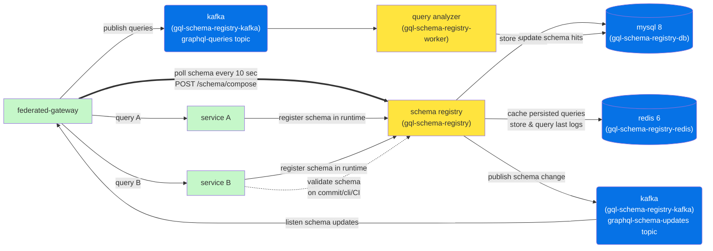
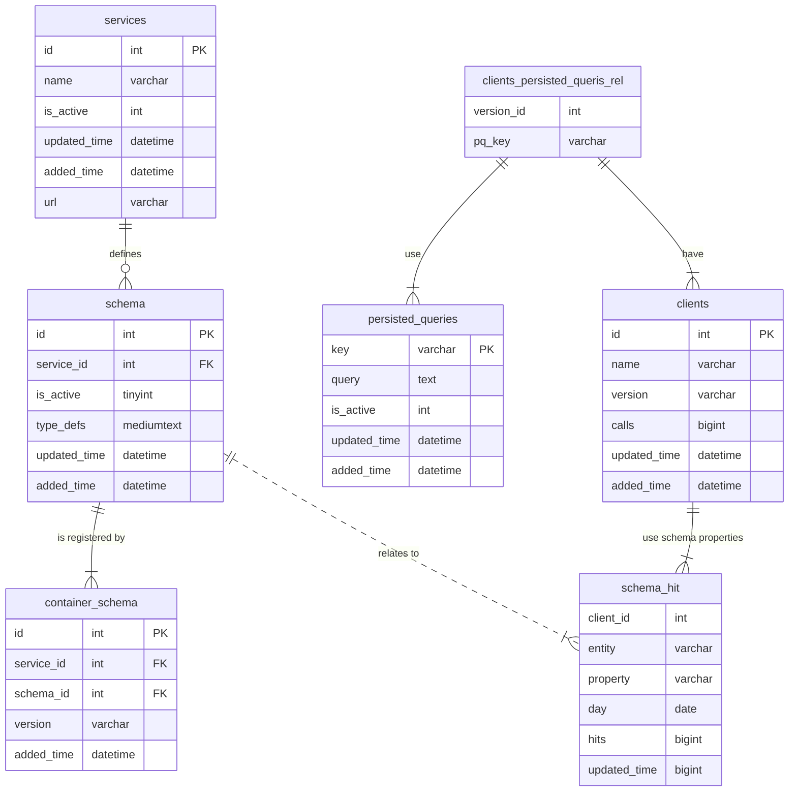
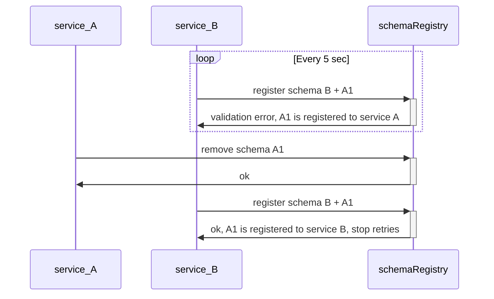

# graphql-schema-registry


Graphql schema storage as dockerized on-premise service for federated graphql gateway server
(based on [apollo server](https://www.apollographql.com/docs/apollo-server/federation/introduction/)) as alternative to [Apollo studio](https://studio.apollographql.com/) and [The Guild's Hive](https://graphql-hive.com)

[](http://gql-schema-registry.slack.com/)

[](https://coveralls.io/github/pipedrive/graphql-schema-registry?branch=master)
[](https://snyk.io/test/github/pipedrive/graphql-schema-registry)
[](https://prettier.io/)

## Features

- Stores versioned schema for graphql-federated services
- Serves supergraph schema for graphql gateway based on provided services & their versions
- Validates new schema to be compatible with other _running_ services
- Provides UI for developers to see stored schema & its history diff
- Stores service urls emulating managed federation: you no longer need to hardcode the services in your gateway's constructor, or rely on an additonal service (etcd, consul) for service discovery
- Does async schema usage analysis to minimize breaking changes from reaching production
- Publishes schema registration events to minimize supergraph update time
- Stores & shows in UI automatic persisted queries (passed by the gateway) for better visibility


## Installation

With default settings, UI should be accessible at [http://localhost:6001](http://localhost:6001)

### On bare host

```
git clone https://github.com/pipedrive/graphql-schema-registry.git && cd graphql-schema-registry
cp example.env .env && nano .env
npm install && npm run build
node app/schema-registry.js
```

### Docker image

We have [docker image published](https://hub.docker.com/r/pipedrive/graphql-schema-registry/tags) for main node service.
It assumes you have mysql/redis running separately.
Use exact IP instead of `localhost`.
Use exact docker image tag to avoid breaking changes.

```
docker pull pipedrive/graphql-schema-registry:5.0.0
docker run -e DB_HOST=localhost -e DB_USERNAME=root -e DB_PORT=6000 -p 6001:3000 pipedrive/graphql-schema-registry
```

### Docker-compose

```
git clone https://github.com/pipedrive/graphql-schema-registry.git && cd graphql-schema-registry
docker-compose -f docker-compose.base.yml -f docker-compose.prod.yml up
```

## Architecture

### Components



| Name              | Role     | Description                                                                                                                                                                                                                                                                                                                    |
| ----------------- | -------- | ------------------------------------------------------------------------------------------------------------------------------------------------------------------------------------------------------------------------------------------------------------------------------------------------------------------------------ |
| federated gateway | Required | Apollo server running in federated mode. You should have your own. Check [examples folder](examples/README.md) how to configure it. Note however, that gateway is very simplified and does not have proper error handling, [query cost limit checks](https://github.com/pipedrive/graphql-query-cost) or fail-safe mechanisms. |
| schema registry   | Required | Main service that we provide                                                                                                                                                                                                                                                                                                   |
| mysql             | Required | Main data storage of schemas and other derivative data                                                                                                                                                                                                                                                                         |
| query analyzer    | Optional | Processes queries in async mode, required for usage tracking. Main code in `/src/worker` folder                                                                                                                                                                                                                                |
| kafka             | Optional | Ties schema-registry and federated gateway with async messaging. Required for fast schema updates and for usage tracking                                                                                                                                                                                                       |
| redis             | Optional | Caching layer for APQs. Not used much atm                                                                                                                                                                                                                                                                                      |

#### Tech stack

| Frontend (`/client` folder) | Backend (`/src` folder)           |
| --------------------------- | --------------------------------- |
| react                       | nodejs 16                         |
| apollo client               | express, hapi/joi                 |
| styled-components           | apollo-server-express, dataloader |
|                             | redis 6                           |
|                             | knex                              |
|                             | mysql 8                           |

### DB structure

Migrations are done using knex



## Configuration

We use environment variables for configuration.
You can:

- pass them directly
- add .env file and dotenv will pick them up
- add them to `docker-compose.yml` or `Dockerfile`

The following are the different environment variables that are looked up that allow configuring the schema registry in different ways.

| Variable Name         | Description                                                                   | Default                   |
| --------------------- | ----------------------------------------------------------------------------- | ------------------------- |
| DB_HOST               | Host name of the MySQL server                                                 | gql-schema-registry-db    |
| DB_USERNAME           | Username to connect to MySQL                                                  | root                      |
| DB_SECRET             | Password used to connect to MySQL                                             | root                      |
| DB_PORT               | Port used when connecting to MySQL                                            | 3306                      |
| DB_NAME               | Name of the MySQL database to connect to                                      | schema-registry           |
| DB_EXECUTE_MIGRATIONS | Controls whether DB migrations are executed upon registry startup or not      | true                      |
| REDIS_HOST            | Host name of the Redis server                                                 | gql-schema-registry-redis |
| REDIS_PORT            | Port used when connecting to Redis                                            | 6379                      |
| REDIS_SECRET          | Password used to connect to Redis                                             | Empty                     |
| ASSETS_URL            | Controls the url that web assets are served from                              | localhost:6001            |
| NODE_ENV              | Specifies the environment. Use _production_ to load js/css from `dist/assets` | Empty                     |
| ASYNC_SCHEMA_UPDATES  | Specifies if async achema updates is enabled                                  | false                     |
| KAFKA_BROKER_HOST     | Host name of the Kafka broker, used if ASYNC_SCHEMA_UPDATES = true            | gql-schema-registry-kafka |
| KAFKA_BROKER_PORT     | Port used when connecting to Kafka, used if ASYNC_SCHEMA_UPDATES = true       | 9092                      |
| KAFKA_SCHEMA_TOPIC    | Topic with new schema                                                         | graphql-schema-updates    |
| KAFKA_QUERIES_TOPIC   | Topic with new schema                                                         | graphql-queries           |
| LOG_LEVEL             | Minimum level of logs to output                                               | info                      |
| LOG_TYPE              | Output log type, supports pretty or json.                                     | pretty                    |

For development we rely on docker network and use hostnames from `docker-compose.yml`.
Node service uses to connect to mysql & redis and change it if you install it with own setup.
For dynamic service discovery (if you need multiple hosts for scaling), override `app/config.js` and `diplomat.js`

## Use cases / FAQ

### When/now do I register schema?

On service start-up (runtime), make POST to /schema/push to register schema (see API reference for details).
Make sure to handle failure.

See [example](examples/schema_registration_client/index.js) for nodejs/ESM.

### How do I register schema that is being developed?

Usually in production, `POST /schema/push` requires unique `version` that should be unique git or docker hash.
But, if you are developing a service and you run schema-registry locally, you can set `version: "latest"` to skip this version check.

### Do I need to deregister services?

- if your gateway uses /schema/compose then no, schema is composed based on services you see as healthy
- if your gateway uses /schema/latest then yes, service has `is_active` flag in DB that you can manually toggle (no API yet)

### When do I need to validate schema?

On pre-commit / deploy make a POST /schema/validate to see if its compatible with current schema.
If you have multiple regions or environments (test), makes sense to check all.

### How do I migrate schema between services?

If service A contains schema that needs to be migrated to service B with close to 0 downtime, you will need to orchestrate schema & traffic change.
Instead of juggling with schema status flags, we suggest the following scenario:



## Development

### Dockerized mode

```
nvm use
npm install
npm run build
docker-compose  -f docker-compose.base.yml  -f docker-compose.dev.yml up
```

### Running in light mode

To have fast iteration of working on UI changes, you can avoid running node service in docker, and run only mysql & redis

```
docker-compose -f docker-compose.base.yml up -d
npm run develop
npm run develop-worker
```

### DB migrations

To create new DB migration, use:

```bash
npm run new-db-migration
```

If not using the default configuration of executing DB migrations on service startup, you can run the following `npm`
command prior to starting the registry:

```bash
npm run migrate-db
```

The command can be prefixed with any environment variable necessary to configure DB connection (in case you ALTER DB with another user), such as:

```bash
DB_HOST=my-db-host DB_PORT=6000 npm run migrate-db
```

## Testing

### Unit tests

use jest, coverage is quite low as most logic is in db or libraries.

```
npm run test
```

### Functional tests

require docker, mostly blackbox type - real http requests are done against containers.
DB tables are truncated after every test from within `test/functional/bootstrap.js`
Jest runs in single worker mode to avoid tests from affecting each other due to same state.

```
#docker-compose -f docker-compose.light.yml up -d
#npm run develop

npm run test-functional
```

### Performance tests

use [k6](https://k6.io/docs/) + dockerized setup similar to functional tests above + grafana and influxdb for reporting the load
these tests are intended just to show/detect avg latencies of most important endpoints

```
docker-compose -f docker-compose.perf-tests.yml up
open http://localhost:8087/dashboard/import
// Add "2587" to ID, pick influxdb datasource, import dashboard and observe it when you run tests

docker-compose -f docker-compose.perf-tests.yml run --rm k6 run /scripts/schema-latest.test.js
```


### Testing Dockerimage build

If you change build process in Dockerfile or Dockerfile.CI, consider checking also testing it

```
# run db
docker-compose -f docker-compose.light.yml up

#build local image
docker build -t local/graphql-schema-registry .

# try to run it
docker run -e DB_HOST=$(ipconfig getifaddr en0) -e DB_USERNAME=root -e DB_PORT=6000 -p 6001:3000 local/graphql-schema-registry
```

## Security & compliance

- There is not strict process on finding or updating vulnerabilitites. The license also states there there is no Liability or Warranty, so be aware of that
- You can use Slack or Github discussions / issues as a communication channel to notify about vulnerabilities.
- We use [snyk](https://snyk.io/test/github/pipedrive/graphql-schema-registry) in PR checks. We try to look at `npm audit` reports manually on PR creation to minimize issues.
- We intentionally use [strict versioning of nodejs dependencies](https://github.com/pipedrive/graphql-schema-registry/blob/master/package.json) which prevents automatic dependabot PRs. Thus version upgrades are manual. Why? Because sometimes we saw external dependencies rolling out breaking changes in minor/patch versions which broke our master. Same thing with hacked libraries.

## Contribution

- Commit often (instead of making huge commits)
- Add verb at the beginning of commit message
- Add why you're doing something in commit message
- Reference issues
- When making a pull request, be sure to follow the format of what is the problem you're fixing, what was changed & how to test it. Screenshots/videos are a welcome
- Fill [CHANGELOG](CHANGELOG.md)
- To avoid vulnerabilities, please use fixed versions in package.json

### Authors and acknowledgment

Current maintainer - [@tot-ra](https://github.com/tot-ra). Mention in PR, if it is stuck

Original internal mission that resulted in this project going live:

- [aleksandergasna](https://github.com/aleksandergasna)
- [ErikSchults](https://github.com/ErikSchults)
- [LexSwed](https://github.com/LexSwed)

See main [blog post](https://medium.com/pipedrive-engineering/journey-to-federated-graphql-2a6f2eecc6a4)

## Rest API documentation

<details>
  <summary><h3>🟢 GET /health</h3></summary>
  
  returns "ok" when service is up
</details>

<details>
  <summary><h3>🟢 GET /schema/latest</h3></summary>
  
Simplified version of /schema/compose where latest versions from different services are composed.
Some services prefer this to use this natural schema composition, as its natural and time-based.

</details>

<details>
  <summary><h3>🟡 POST /schema/compose</h3></summary>
  
Advanced version of schema composition, where you need to provide services & their versions.
Used by graphql gateway to fetch schema based on currently running containers.

The advantage over time-based composition is that versioned composition allows to automatically
update federated schema when you deploy older version of the pod in case of some incident.
If you deploy older pods they can ofc try to register old schema again, but as it already exists
in schema-registry, it will not be considered as "latest".

#### Request params (optional, raw body)

```json
{
  "services": [
    { "name": "service_a", "version": "ke9j34fuuei" },
    { "name": "service_b", "version": "e302fj38fj3" }
  ]
}
```

#### Response example

- ❌ 400 "services[0].version" must be a string
- ❌ 500 Internal error (DB is down)
- ✅ 200

```json
{
  "success": true,
  "data": [
    {
      "id": 2,
      "service_id": 3,
      "version": "ke9j34fuuei",
      "name": "service_a",
      "url": "http://localhost:6111",
      "added_time": "2020-12-11T11:59:40.000Z",
      "type_defs": "\n\ttype Query {\n\t\thello: String\n\t}\n",
      "is_active": 1
    },
    {
      "id": 3,
      "service_id": 4,
      "version": "v1",
      "name": "service_b",
      "url": "http://localhost:6112",
      "added_time": "2020-12-14T18:51:04.000Z",
      "type_defs": "type Query {\n  world: String\n}\n",
      "is_active": 1
    }
  ]
}
```

#### Request params

- services{ name, version}

If `services` is not passed, schema-registry tries to find most recent versions. Logic behind the scenes is that schema with _highest_ `added_time` OR `updated_time` is picked as latest. If time is the same, `schema.id` is used.

</details>
<details>
  <summary><h3>🟡 POST /schema/push</h3></summary>

Validates and registers new schema for a service.

#### Request params (optional, raw body)

```json
{
  "name": "service_a",
  "version": "ke9j34fuuei",
  "type_defs": "\n\ttype Query {\n\t\thello: String\n\t}\n"
}
```

URL is optional if you use urls from schema-registry as service discovery

```json
{
  "name": "service_b",
  "version": "jiaj51fu91k",
  "type_defs": "\n\ttype Query {\n\t\tworld: String\n\t}\n",
  "url": "http://service-b.develop.svc.cluster.local"
}
```

- ❌ 400 "You should not register different type_defs with same version."
</details>

<details>
  <summary><h3>🟡 POST /schema/validate</h3></summary>

Validates schema, without adding to DB

##### Request params (raw body)

- name
- version
- type_defs
</details>
<details>
  <summary><h3>🟡 POST /schema/diff</h3></summary>

Compares schemas and finds breaking or dangerous changes between provided and latest schemas.

- name
- version
- type_defs

</details><details><summary><h3>🔴 DELETE /schema/:schemaId</h3></summary>

Deletes specified schema

##### Request params

| Property   | Type   | Comments      |
| ---------- | ------ | ------------- |
| `schemaId` | number | ID of sechema |

</details><details><summary><h3>🔴 DELETE /service/:name</h3></summary>

Deletes specified service including all schemas registered for that service

##### Request params

| Property | Type   | Comments        |
| -------- | ------ | --------------- |
| `name`   | string | name of service |

</details><details><summary><h3>🟢 GET /persisted_query</h3></summary>

Looks up persisted query from DB & caches it in redis if its found

##### Request params (query)

| Property | Type   | Comments                         |
| -------- | ------ | -------------------------------- |
| `key`    | string | hash of APQ (with `apq:` prefix) |

</details><details><summary><h3>🟡 POST /persisted_query</h3></summary>

Adds persisted query to DB & redis cache

##### Request params (raw body)

| Property | Type   | Comments                         |
| -------- | ------ | -------------------------------- |
| `key`    | string | hash of APQ (with `apq:` prefix) |
| `value`  | string | Graphql query                    |

</details>
